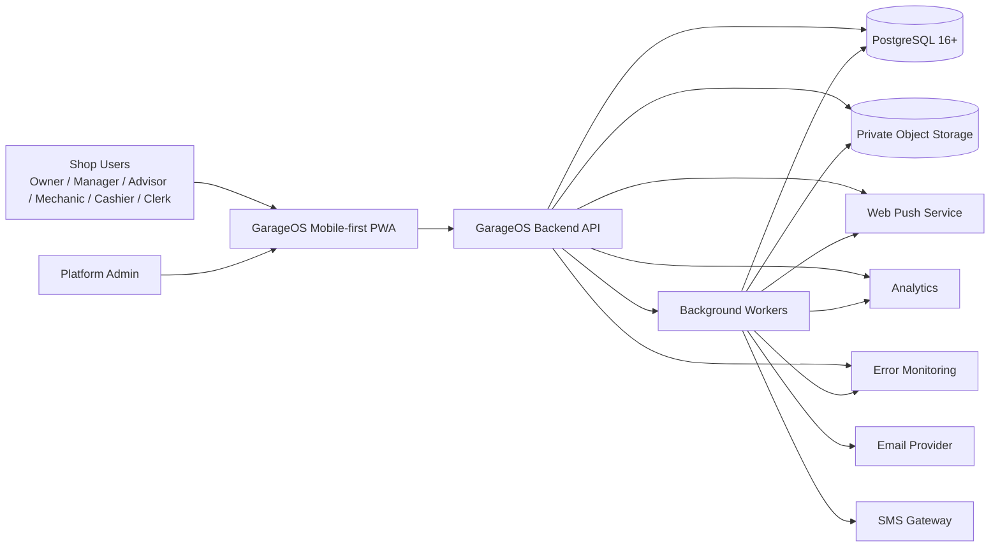
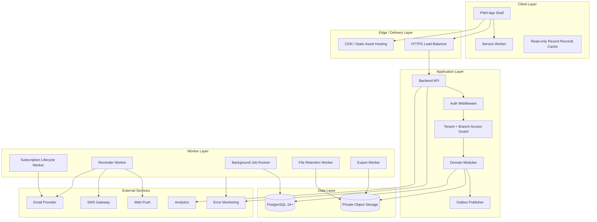
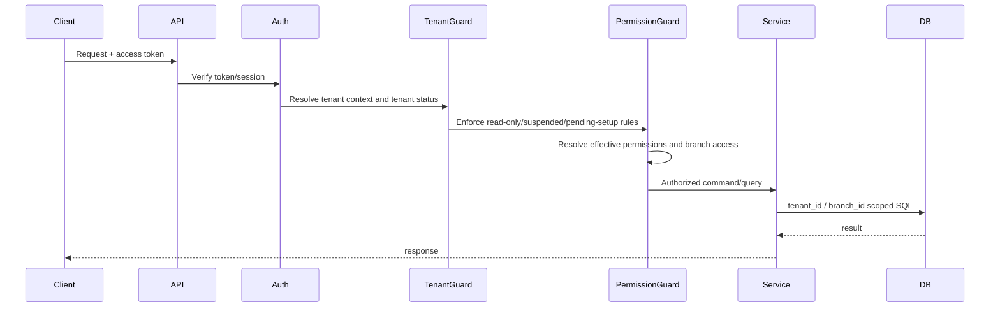
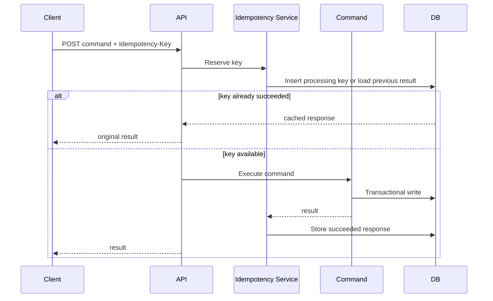
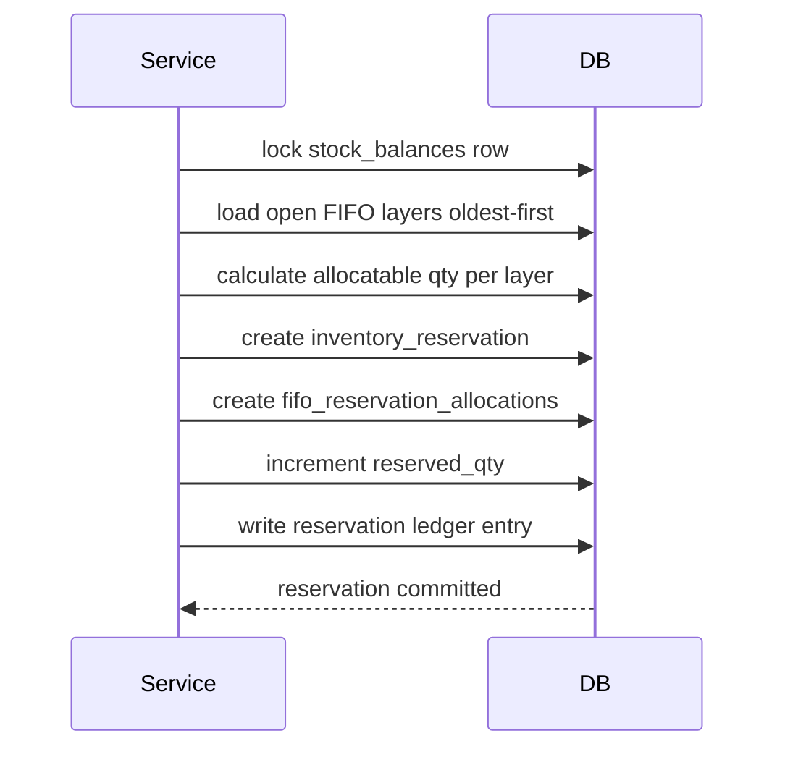
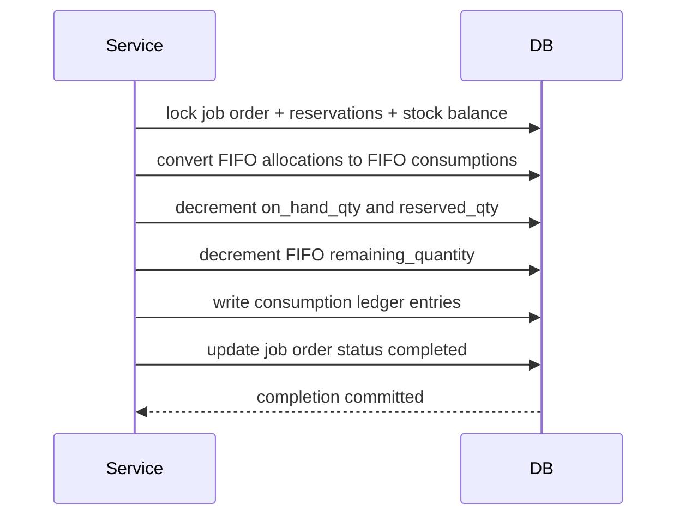
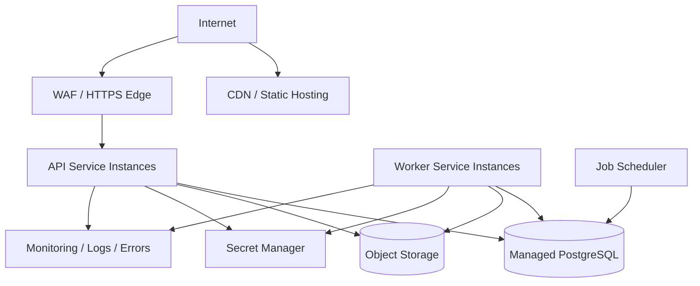

# GarageOS Architecture

**Document:** `architecture.md`  
**Source Documents:** `requirements.md`, `database-design.md`, `database-schema.md`  
**Generated:** 2026-06-24  
**Status:** Build-ready architecture specification  
**System:** GarageOS — Motorcycle Shop Management System SaaS  
**Target Client:** Mobile-first Progressive Web App  
**Primary Database Target:** PostgreSQL 16+

---

## 1. Purpose

This document defines the recommended production architecture for GarageOS. It translates the approved product requirements, database design, and physical schema into an implementation-ready system architecture covering frontend, backend, database, background jobs, integrations, security, observability, deployment, and validation.

This document is not a code-level implementation guide. It is the architectural source document that should guide API design, service boundaries, repository structure, infrastructure planning, deployment topology, testing strategy, and future ADRs.

---

## 2. Source-of-Truth Alignment

The architecture follows these source documents in order:

1. `requirements.md`
2. `database-design.md`
3. `database-schema.md`

When this document appears to conflict with the PRD, database design, or database schema, the source documents win. Any technology choice in this document that is not explicitly required by the source documents is a recommended implementation decision, not a product requirement.

---

## 3. Architecture Principles

1. **Documentation first.** Product requirements, database design, schema, and accepted ADRs are the source of truth.
2. **Modular monolith first.** Use one deployable backend with strong module boundaries before considering distributed microservices.
3. **Tenant isolation everywhere.** Every tenant-owned operation must be scoped by `tenant_id`; branch-specific operations must also be scoped by `branch_id`.
4. **Database-enforced invariants.** Critical rules should be protected with constraints, unique indexes, row locks, optimistic locking, append-only triggers, and idempotency keys.
5. **Ledger-first inventory.** Stock-changing operations must write immutable inventory ledger entries and update stock summaries transactionally.
6. **FIFO correctness over simplicity.** FIFO layers, FIFO reservation allocations, and FIFO consumptions are first-class architectural concerns.
7. **Financial immutability.** Issued invoices, payments, receipts, refunds, audit logs, and inventory ledgers must not be directly edited.
8. **Retry-safe background processing.** Jobs must be observable, idempotent where needed, and safe to retry only when side effects cannot duplicate.
9. **Mobile-first operations.** Core shop workflows must remain usable on small mobile screens and unstable mobile networks.
10. **Operational visibility.** Every critical path must produce structured logs, metrics, audit logs, and failure alerts.

---

## 4. Specialist Panel Architecture Review

### 4.1 Product Owner / Business Stakeholder

**Priority:** recurring SaaS revenue, plan-based monetization, operational continuity, tenant export, tenant retention/deletion lifecycle.

**Architecture decision:** keep subscription plans, plan limits, lifecycle status, read-only/suspension enforcement, tenant export, and tenant deletion as platform-level modules instead of embedding them inside individual business modules.

### 4.2 Product Manager / Business Analyst

**Priority:** state-driven workflows with clear acceptance criteria.

**Architecture decision:** implement every major workflow as command-driven application services with explicit transition validation, status history records, audit logs, and transaction boundaries.

### 4.3 Senior Database Architect

**Priority:** consistency under concurrency, especially inventory, FIFO, invoicing, payments, refunds, transfers, and tenant deletion.

**Architecture decision:** use PostgreSQL as the transactional source of truth, enforce critical uniqueness and non-negative constraints in the database, and use row-level locks or optimistic locking for critical write paths.

### 4.4 Senior Backend Engineer / Tech Lead

**Priority:** maintainable implementation with clear service boundaries.

**Architecture decision:** implement a modular monolith with domain modules, application command services, repositories, integration adapters, shared infrastructure utilities, and clear transaction orchestration.

### 4.5 Performance & Scalability Engineer

**Priority:** tenant-scoped operational queries, reports, search, ledgers, and dashboard workloads.

**Architecture decision:** use tenant/branch/date/status indexes, reporting read models, full-text/trigram search read models, keyset pagination, async exports, and partition-ready append-only tables.

### 4.6 Security & Compliance Reviewer

**Priority:** tenant isolation, sensitive data handling, audited support access, authentication safety, and file access control.

**Architecture decision:** enforce authorization in middleware and service policies, use hashed secrets/tokens, avoid storing card data, generate signed URLs for files, and audit platform support access.

### 4.7 DevOps / Operations Engineer

**Priority:** predictable deployment, backup/restore, observability, background job reliability, and disaster recovery.

**Architecture decision:** use containerized web/API/worker services, managed PostgreSQL, object storage, structured logs, error monitoring, daily encrypted backups, and quarterly restore tests.

### 4.8 QA / Data Integrity Engineer

**Priority:** proving correctness, especially under concurrency and edge cases.

**Architecture decision:** build acceptance tests around tenant isolation, branch access, document numbering, no overbilling, no overpayment, no over-reservation, FIFO correctness, immutable receipts, read-only tenant enforcement, and retry-safe jobs.

---

## 5. High-Level System Context



---

## 6. Recommended Technology Architecture

The source documents explicitly require a mobile-first PWA and PostgreSQL 16+ schema target. The following implementation stack is recommended for consistency, maintainability, and cost control.

| Layer           | Recommended Choice                                                  | Rationale                                                                                                      |
| --------------- | ------------------------------------------------------------------- | -------------------------------------------------------------------------------------------------------------- |
| Client          | TypeScript mobile-first PWA                                         | Aligns with required PWA target and offline shell/read-only cache.                                             |
| UI Framework    | React / Next.js or equivalent                                       | Strong PWA ecosystem, routing, caching, and server/client rendering options.                                   |
| Backend         | TypeScript modular monolith                                         | Keeps complex transaction orchestration simple while preserving clean module boundaries.                       |
| API Style       | REST-first with command endpoints for workflows                     | Easy to validate, test, authorize, document, and map to mobile workflows.                                      |
| Database        | PostgreSQL 16+                                                      | Matches schema target and supports transactions, row locks, FTS, trigram indexes, JSONB, constraints, and RLS. |
| Background Jobs | Database-backed jobs/outbox first                                   | Matches schema tables, avoids extra infrastructure early, supports idempotency and observability.              |
| File Storage    | Private S3-compatible object storage                                | Tenant-scoped paths, signed URLs, lifecycle deletion, export packaging.                                        |
| Cache           | Browser PWA cache plus optional server-side ephemeral cache         | Authoritative data remains PostgreSQL; offline cache remains read-only.                                        |
| Observability   | Structured logs, metrics, error monitoring, tracing/correlation IDs | Required for API latency, background failures, delivery failures, auth failures, and inventory failures.       |
| Deployment      | Containers behind HTTPS load balancer                               | Supports horizontal scaling and clear web/API/worker separation.                                               |

### 6.1 Why Modular Monolith First

GarageOS has many workflows that must update several records atomically: payment plus receipt, job completion plus inventory consumption, transfer receiving plus FIFO movement, invoice issuance plus billing allocations, and supplier return plus AP/credit updates. Splitting these workflows across microservices too early would increase distributed transaction risk, operational complexity, latency, and debugging cost.

The recommended backend is one deployable application with strict internal modules. Modules communicate through application services and domain events, not direct cross-module table mutation.

Microservices should be considered only after production usage proves a clear scaling or organizational need.

---

## 7. Container-Level Architecture



---

## 8. Backend Architectural Style

### 8.1 Layering

```text
backend/
  modules/
    auth/
    tenants/
    subscriptions/
    platform-admin/
    users/
    roles-permissions/
    branches/
    customers/
    motorcycles/
    services/
    estimates/
    job-orders/
    mechanic-sessions/
    products-inventory/
    inventory-adjustments/
    inventory-transfers/
    suppliers/
    purchases/
    invoices/
    payments-refunds/
    expenses/
    reminders/
    notifications/
    files/
    reports/
    audit/
    exports/
    background-jobs/
  shared/
    database/
    transactions/
    authorization/
    validation/
    idempotency/
    observability/
    errors/
    time/
    money/
    files/
```

### 8.2 Internal Layers per Module

Each backend module should use this structure:

```text
module/
  api/             HTTP controllers, request/response DTOs
  application/     command handlers, query handlers, transaction orchestration
  domain/          pure business rules, state machines, calculations
  persistence/     repositories, SQL/ORM mappings
  policies/        permission and branch/tenant access checks
  events/          outbox event definitions and handlers
  tests/           module-level unit/integration tests
```

### 8.3 Command/Query Separation

Use separate service paths for writes and reads:

- **Commands** perform validation, authorization, idempotency checks, transaction orchestration, status transitions, audit logging, and side-effect scheduling.
- **Queries** perform tenant/branch-scoped reads, pagination, search, and report retrieval.

This does not require full CQRS infrastructure. It is an implementation discipline to protect complex writes from being mixed with read/query concerns.

---

## 9. Core Domain Modules

| Module                    | Responsibility                                                                      | Critical Notes                                                                       |
| ------------------------- | ----------------------------------------------------------------------------------- | ------------------------------------------------------------------------------------ |
| Auth                      | Login, logout, verification, password reset, sessions, rate limits                  | Tokens must be hashed where stored; sessions revoked on deactivation/password reset. |
| Tenant Lifecycle          | Tenant status, onboarding gates, subscription expiry, read-only/suspension/deletion | Must run before operational permission checks.                                       |
| Platform Admin            | Tenant management, plans, overrides, audited support access                         | Platform admins are not tenant employees.                                            |
| RBAC                      | Roles, permissions, branch assignments, effective permission resolution             | Additive permissions; no explicit deny.                                              |
| Customers & Motorcycles   | Tenant-wide customer/motorcycle records, search, duplicate warning, restoration     | Histories remain branch-restricted.                                                  |
| Service Work              | Services, estimates, job orders, mechanic sessions                                  | Status transitions must be explicit and audited.                                     |
| Inventory                 | Products, stock balances, reservations, FIFO, ledger, low-stock alerts              | Ledger and FIFO are authoritative for stock movement/costing.                        |
| Transfers                 | Branch-to-branch transfers and variance handling                                    | Must preserve FIFO cost references.                                                  |
| Purchasing & AP           | Purchase orders, receiving, supplier returns, supplier payments/credits             | Credit purchases affect AP; cash purchases do not.                                   |
| Invoicing & AR            | Invoices, billing allocations, tax, discounts, AR                                   | Billing allocations prevent overbilling.                                             |
| Payments & Refunds        | Payments, receipts, refunds, inventory reversal option                              | Every payment creates one immutable receipt.                                         |
| Expenses                  | Expense categories, expense records, edits, voids                                   | Voided expenses excluded from profit reports.                                        |
| Reminders & Notifications | Customer reminders, internal notifications, delivery attempts                       | Plan-based channel enforcement.                                                      |
| Files & Exports           | Tenant-scoped files, signed URLs, export packages, attachment manifests             | No permanent public tenant file URLs.                                                |
| Reports & Dashboard       | Operational reports, snapshots, exports                                             | Large exports must run asynchronously.                                               |
| Audit                     | Immutable audit logs and platform audit logs                                        | Critical actions cannot bypass audit logging.                                        |
| Background Jobs           | Retry-safe jobs, outbox, attempts, failure alerts                                   | Must not duplicate irreversible side effects.                                        |

---

## 10. Tenant and Access Control Architecture

### 10.1 Request Access Pipeline



### 10.2 Tenant Context

Every authenticated tenant request must resolve:

- `actor_user_id`
- `tenant_id`
- `tenant_status`
- `subscription_status_source`
- `assigned_branch_ids`
- `tenant_wide_branch_access`
- `effective_permissions`
- optional `platform_support_access_session_id`

### 10.3 Enforcement Layers

Tenant and branch isolation should be enforced at multiple layers:

1. **Routing/API layer** rejects missing or invalid tenant context.
2. **Authorization policy layer** checks action permissions and branch scope.
3. **Service layer** validates business rules and lifecycle status.
4. **Repository/query layer** requires `tenant_id` and, for branch-specific records, `branch_id`.
5. **Database layer** uses foreign keys, unique constraints, indexes, and recommended RLS defense-in-depth.

### 10.4 Tenant Status Gate

All operational write commands must check tenant status before business validation.

| Tenant Status      | Architecture Rule                                                                     |
| ------------------ | ------------------------------------------------------------------------------------- |
| `pending_setup`    | Owner may complete onboarding only; operational modules blocked.                      |
| `active`           | Full access based on permissions.                                                     |
| `grace_period`     | Full access based on permissions plus renewal warnings.                               |
| `read_only`        | Reads, exports, renewal, password change, logout allowed; operational writes blocked. |
| `suspended`        | Owner renewal/export only; non-owner users blocked.                                   |
| `pending_deletion` | Operational access blocked; deletion workflow active.                                 |
| `deleted`          | No tenant operational access.                                                         |

---

## 11. Data Architecture

### 11.1 Database Model

GarageOS uses a shared PostgreSQL database and shared schema with strict tenant isolation.

Core database rules:

- All tenant-owned tables include `tenant_id`.
- Branch-specific operational tables include both `tenant_id` and `branch_id`.
- Financial, inventory, audit, event, and status history tables are append-only or correction-only.
- Document numbers are tenant-scoped and never reused.
- Monetary values use fixed precision decimal types.
- Business dates are interpreted using tenant timezone.
- Critical source-of-truth records are relational, not JSON-only.

### 11.2 Data Ownership Categories

| Category            | Examples                                                                    | Scope                          |
| ------------------- | --------------------------------------------------------------------------- | ------------------------------ |
| Platform-owned      | platform admins, plan definitions, platform audit logs                      | Platform-wide                  |
| Tenant-wide         | customers, motorcycles, products, suppliers, roles, files, audit logs       | `tenant_id`                    |
| Branch-specific     | job orders, invoices, purchases, inventory balances, transfers, expenses    | `tenant_id` + `branch_id`      |
| Append-only ledgers | inventory ledger, FIFO consumption, payments, receipts, refunds, audit logs | Immutable history              |
| Read models         | report snapshots, search documents, dashboard snapshots                     | Rebuildable from source tables |

### 11.3 Transactional Source of Truth

Transactional source tables remain authoritative. Reporting snapshots, dashboard snapshots, and search documents are derived and may be rebuilt.

Examples:

- Inventory truth comes from ledger entries, stock balances, FIFO layers, FIFO allocations, and FIFO consumptions.
- AR comes from invoices, payments, refunds, and invoice status.
- AP comes from received credit purchases, supplier payments, supplier returns, and supplier credits.
- Reports read from source tables or approved read models generated from source tables.

---

## 12. Critical Transaction Architecture

All critical writes must run inside database transactions and use row locks, optimistic locks, unique constraints, or idempotency keys where appropriate.

| Workflow                          | Transaction Boundary                                                                                            |
| --------------------------------- | --------------------------------------------------------------------------------------------------------------- |
| Invoice creation/update/issuance  | invoice, invoice lines, invoice-job-order links, billing allocations, source job order lines, document sequence |
| Payment + receipt                 | invoice, payment, receipt, receipt sequence, audit log                                                          |
| Refund                            | payment, invoice, refund, optional inventory reversal, audit log                                                |
| Job order completion              | job order, reservations, stock balances, FIFO allocations, FIFO consumptions, inventory ledger                  |
| Inventory reservation             | stock balance, FIFO layers, FIFO allocation, reservation, ledger                                                |
| Reservation release               | reservation, stock balance, FIFO allocation, ledger                                                             |
| Inventory adjustment posting      | adjustment, stock balance, FIFO layers, ledger, audit log                                                       |
| Purchase receiving                | purchase order lines, stock balance, FIFO layers, AP records, ledger                                            |
| Supplier return                   | supplier return, stock balance, FIFO layers, supplier payable/credit, ledger                                    |
| Inventory transfer receive/cancel | transfer, transfer lines, source/destination stock balances, FIFO layers, ledger                                |
| Tenant deletion                   | tenant deletion job, tenant-owned records, storage deletion manifest, audit preservation                        |

---

## 13. Idempotency Architecture

Client-retryable critical write APIs must support idempotency.

### 13.1 Idempotency Scope

An idempotency key is scoped by:

- `tenant_id`
- `user_id`
- endpoint or command type
- request intent hash
- idempotency key hash

### 13.2 Idempotency Flow



### 13.3 Required Idempotent Commands

At minimum:

- invoice issuance
- payment creation
- refund creation
- receipt generation
- inventory reservation
- inventory consumption
- inventory adjustment posting
- purchase receiving
- supplier return posting
- supplier payment creation
- inventory transfer stock-affecting status changes
- tenant deletion job execution

---

## 14. Inventory and FIFO Architecture

### 14.1 Inventory Concepts

| Concept                        | Role                                                                 |
| ------------------------------ | -------------------------------------------------------------------- |
| `stock_balances`               | Fast branch/product quantity summary.                                |
| `inventory_ledger_entries`     | Immutable record of every stock-changing event.                      |
| `fifo_layers`                  | Stock quantity received at a specific unit cost.                     |
| `inventory_reservations`       | Allocation of available stock for job orders or submitted transfers. |
| `fifo_reservation_allocations` | FIFO layer reservations without reducing FIFO remaining quantity.    |
| `fifo_consumptions`            | Actual FIFO consumption when stock leaves inventory.                 |

### 14.2 Reservation Flow



### 14.3 Consumption Flow



### 14.4 Inventory Integrity Rules

- Available stock is calculated as `on_hand_qty - reserved_qty`.
- Normal transactions must not create negative available stock.
- `on_hand_qty` must not be lower than `reserved_qty`.
- FIFO allocations must not exceed allocatable FIFO layer quantity.
- FIFO consumption must use oldest allocated layers first.
- Inventory corrections must use approved adjustment, refund reversal, void reversal, supplier return, or transfer variance workflows.

---

## 15. Financial Architecture

### 15.1 Invoice and Billing Allocation

Invoices may be linked to one or more job orders. One job order may also be billed through multiple invoices. To prevent overbilling, invoice lines that originate from job order lines must create billing allocations.

Allocation statuses:

- `reserved` for draft invoices
- `final` for issued active invoices
- `released` for cancelled or voided invoices
- `closed` for refunded invoices that should not be billed again automatically

Remaining billable quantity or amount must be calculated using source job order line authorization minus reserved, final, and closed allocations.

### 15.2 Payment and Receipt

Payment creation must:

1. Validate invoice status and remaining collectible balance.
2. Validate amount is greater than zero and not an overpayment.
3. Generate one tenant-scoped receipt number.
4. Create exactly one payment.
5. Create exactly one immutable receipt.
6. Recalculate invoice paid amount, remaining collectible balance, and status.
7. Write audit logs.

### 15.3 Refunds

Refunds must not delete or edit original payments or receipts. Refunds reduce refundable amount and recalculate invoice balance/status. Inventory is not restored unless the authorized user explicitly selects inventory reversal.

### 15.4 Operational Financial Reports

Financial reports are operational management reports, not a full accounting system. Revenue, collections, COGS, gross profit, AR, AP, expenses, refunds, and voids must follow the PRD calculation rules.

---

## 16. Workflow State Machine Architecture

Every stateful workflow should have:

- status column
- status transition validator
- status history table
- audit log entry
- service-layer transition command
- integration tests for allowed and blocked transitions

Stateful workflows include:

- tenant lifecycle
- employee invitation
- branch activation/deactivation
- customer merge/delete/restore
- motorcycle delete/restore
- estimate lifecycle
- job order lifecycle
- mechanic work sessions
- inventory adjustment lifecycle
- inventory transfer lifecycle
- purchase order lifecycle
- supplier return lifecycle
- invoice lifecycle
- refund lifecycle
- expense edit/void lifecycle
- reminder lifecycle
- file lifecycle
- background job lifecycle

---

## 17. API Architecture

### 17.1 API Style

Use REST resources for CRUD-style operations and command endpoints for workflow transitions.

Examples:

```text
POST   /api/v1/auth/login
POST   /api/v1/tenants/{tenantId}/onboarding/complete
POST   /api/v1/job-orders/{jobOrderId}/status/complete
POST   /api/v1/invoices/{invoiceId}/issue
POST   /api/v1/invoices/{invoiceId}/payments
POST   /api/v1/payments/{paymentId}/refunds
POST   /api/v1/inventory/reservations
POST   /api/v1/inventory-adjustments/{adjustmentId}/post
POST   /api/v1/inventory-transfers/{transferId}/receive
POST   /api/v1/tenant-exports
```

### 17.2 API Standards

- All write requests validate idempotency when required.
- All tenant requests require tenant context.
- All branch-specific requests validate branch access.
- Pagination must be cursor/keyset-based for large tables.
- Errors must use stable error codes suitable for mobile UI handling.
- Monetary amounts must be strings or decimal-safe values in APIs.
- Date/time responses must include canonical UTC timestamps and business-date fields where applicable.

### 17.3 Error Model

Recommended error shape:

```json
{
  "error": {
    "code": "INVENTORY_AVAILABLE_STOCK_INSUFFICIENT",
    "message": "Available stock is insufficient for this reservation.",
    "details": {
      "availableQuantity": "2.000",
      "requestedQuantity": "3.000"
    },
    "correlationId": "req_..."
  }
}
```

---

## 18. Frontend / PWA Architecture

### 18.1 PWA Requirements

The client must be:

- mobile-first
- installable
- responsive
- usable on modern mobile browsers
- optimized for touch workflows
- usable at minimum 360px width
- capable of loading an offline app shell
- capable of read-only viewing of recently viewed records when offline

### 18.2 Frontend Structure

```text
frontend/
  app/
    auth/
    onboarding/
    dashboard/
    customers/
    motorcycles/
    job-orders/
    inventory/
    purchases/
    invoices/
    payments/
    reports/
    settings/
    platform-admin/
  components/
    layout/
    forms/
    tables/
    workflow/
    offline/
  services/
    api-client/
    auth-session/
    offline-cache/
    notifications/
  domain/
    money/
    dates/
    permissions/
    status-labels/
```

### 18.3 Offline Behavior

Offline support is intentionally read-only.

The service worker may cache:

- application shell
- static assets
- recently viewed customers
- recently viewed motorcycles
- recently viewed job orders
- recently viewed invoices

Offline mode must not allow:

- creates
- edits
- approvals
- payments
- refunds
- inventory actions
- file uploads
- settings changes
- role/permission changes

### 18.4 Frontend Authorization UX

Frontend controls should hide or disable actions based on permissions, branch access, tenant status, plan limits, and offline status. Backend authorization remains authoritative.

---

## 19. Background Job and Outbox Architecture

### 19.1 Required Job Types

The architecture must support background jobs for:

- large tenant exports
- large report exports
- reminder due evaluation
- reminder delivery
- subscription lifecycle transitions
- deletion warning notifications
- tenant deletion execution
- file permanent deletion after retention
- low-stock alert evaluation
- async email/SMS delivery processing
- report snapshot refreshes
- search document refreshes

### 19.2 Job State Model

Jobs use these states:

```text
queued -> running -> succeeded
queued -> running -> failed
queued -> cancelled
failed -> queued    only when retry-safe
failed -> dead_lettered after retry exhaustion, if implemented
```

### 19.3 Worker Rules

- Workers must acquire jobs with locks.
- Workers must update attempt count and last error.
- Workers must use correlation IDs.
- Workers must avoid retrying permanent failures.
- Workers must write failure events for platform/admin alerts.
- Irreversible operations must be idempotent.

### 19.4 Outbox Pattern

Use an outbox table for events that must be published after database commit.

Examples:

- payment recorded
- receipt generated
- low stock alert triggered
- reminder due
- export completed
- tenant status changed
- employee deactivated

The outbox publisher must only publish committed events and mark events as published after successful delivery.

---

## 20. File and Object Storage Architecture

### 20.1 File Storage Rules

Tenant files must be stored under tenant-scoped private paths.

Recommended object key format:

```text
tenants/{tenant_id}/{entity_type}/{entity_id}/{file_id}-{safe_filename}
```

### 20.2 File Access

- Files are private by default.
- Access is controlled by tenant, branch, linked entity, and permission.
- File downloads use time-limited signed URLs.
- Public permanent URLs are prohibited for tenant files.
- Signed URLs must not be cached offline beyond their expiration.

### 20.3 Malware Scanning

Malware scanning is optional infrastructure in the build. When configured:

- New uploads are marked pending scan.
- Infected files are quarantined or blocked from normal tenant access.
- Quarantined files are excluded from downloadable export binaries but listed in manifests.

### 20.4 Tenant Export Packaging

Full tenant exports must generate ZIP packages containing:

- CSV data
- JSON relationship data
- audit log export
- attachment manifest
- optional attachment binaries
- README

Large exports must run asynchronously. Export download links expire after 7 days.

---

## 21. Reporting, Dashboard, and Search Architecture

### 21.1 Reporting Strategy

Reports must respect tenant and branch access rules. Default interactive reports should query source tables or reporting read models for date ranges up to 90 days. Reports estimated above synchronous limits must run as background exports.

### 21.2 Reporting Read Models

Use rebuildable read models for:

- daily sales
- daily payments
- stock valuation snapshots
- dashboard snapshots
- advanced operational reports

Read models must never replace source-of-truth transactional tables.

### 21.3 Search Strategy

Use a hybrid search approach:

- normalized exact lookup columns for email, mobile, SKU, barcode, plate, engine, chassis, document numbers
- PostgreSQL full-text search for multi-field search documents
- trigram indexes for fuzzy name/model/product search

Search results must always be scoped by `tenant_id` and branch access where histories are branch-specific.

---

## 22. Security Architecture

### 22.1 Authentication

- Passwords must be hashed with Argon2id or bcrypt cost 12+.
- Access tokens should expire within 15 minutes.
- Refresh tokens must rotate.
- Remember-me sessions may last up to 30 days.
- Sessions must be revoked on user deactivation and admin password reset.
- Reset, invite, verification, and refresh tokens must be stored as hashes.

### 22.2 Authorization

Authorization must combine:

- tenant status
- user status
- email verification state
- effective role permissions
- branch assignments
- plan limits/channel permissions
- platform support access mode

### 22.3 Sensitive Data Handling

The system must not store or log:

- plaintext passwords
- password reset tokens
- email verification tokens
- access tokens
- refresh tokens
- CVV
- card numbers
- magnetic stripe data
- unnecessary sensitive free-text data in analytics/error monitoring

### 22.4 Platform Support Access

Platform support access must:

- require reason
- default to read-only
- support explicit write-allowed mode only for authorized platform users
- create support access session records
- audit every support action as platform-admin activity
- visually mark support sessions in the UI

### 22.5 Row-Level Security

PostgreSQL Row-Level Security is recommended as defense-in-depth once application tenant context propagation is reliable. It should not replace application authorization checks.

---

## 23. Observability Architecture

### 23.1 Required Telemetry

The platform must track:

- API latency and error rate
- background job failures
- SMS delivery failures
- email delivery failures
- storage usage
- database growth
- authentication failures
- authorization failures
- export job status
- reminder delivery status
- inventory transaction failures

### 23.2 Logging Standards

All backend logs should be structured JSON and include:

- timestamp
- level
- environment
- service name
- correlation ID
- tenant ID when applicable
- user ID when applicable
- request path or job type
- error code
- sanitized error details

### 23.3 Metrics

Recommended minimum metrics:

| Metric                                 | Purpose                       |
| -------------------------------------- | ----------------------------- |
| `http_request_duration_ms`             | API latency SLO tracking.     |
| `http_request_errors_total`            | API reliability tracking.     |
| `background_jobs_failed_total`         | Worker reliability.           |
| `background_jobs_retry_total`          | Retry behavior visibility.    |
| `auth_failures_total`                  | Security monitoring.          |
| `authorization_denials_total`          | Access control visibility.    |
| `inventory_transaction_failures_total` | Stock correctness monitoring. |
| `notification_delivery_failures_total` | Provider/channel visibility.  |
| `export_job_duration_ms`               | Export performance.           |
| `db_pool_saturation`                   | Capacity planning.            |

### 23.4 Alerts

Alert on:

- critical background job failure
- repeated tenant deletion failure
- payment/receipt transaction failure spike
- inventory transaction failure spike
- SMS/email provider failure spike
- database storage threshold
- backup failure
- high API error rate
- sustained P95/P99 latency breach

---

## 24. Deployment Architecture

### 24.1 Production Topology



### 24.2 Deployable Units

| Unit           | Responsibility                                              | Scaling                                                     |
| -------------- | ----------------------------------------------------------- | ----------------------------------------------------------- |
| PWA static app | Client application shell and assets                         | CDN-backed.                                                 |
| API service    | Authenticated API, commands, queries, signed URL generation | Horizontally scalable.                                      |
| Worker service | Background jobs, outbox, reminders, exports, lifecycle jobs | Horizontally scalable with job locking.                     |
| Scheduler      | Periodic job enqueuing                                      | Single active scheduler or leader election.                 |
| PostgreSQL     | Transactional source of truth                               | Managed primary with backups and read replicas when needed. |
| Object storage | Tenant-scoped private files and export packages             | Provider-managed scaling.                                   |

### 24.3 Environment Strategy

Recommended environments:

- `local`
- `development`
- `staging`
- `production`

Staging should mirror production architecture closely enough to test migrations, background jobs, exports, object storage permissions, and restore procedures.

### 24.4 Migration Strategy

- Migrations must be version-controlled.
- Migrations must be forward-only in production.
- Large backfills must be batched and observable.
- Destructive migrations require backup and explicit rollout plan.
- Append-only triggers and RLS policies should be introduced carefully with integration tests.

---

## 25. Backup, Retention, and Disaster Recovery

### 25.1 Backup Policy

- Daily encrypted database backups.
- Backup retention at least 30 days.
- Encrypted object storage.
- Quarterly restore testing by platform operators.

### 25.2 Disaster Recovery Targets

| Target | Requirement |
| ------ | ----------- |
| RPO    | 24 hours    |
| RTO    | 4 hours     |

### 25.3 Tenant Deletion and Retention

Tenant deletion must:

- follow subscription lifecycle rules
- delete tenant-owned operational production records when eligible
- delete tenant-owned object storage files when eligible
- preserve platform-retained audit metadata for required retention
- avoid restoring deleted tenant data to tenant use except platform-wide disaster recovery

---

## 26. Performance Architecture

### 26.1 Performance Targets

| Metric                     | Target                                                    |
| -------------------------- | --------------------------------------------------------- |
| Initial page load          | Less than 3 seconds on modern mobile browser over 4G      |
| API P50 latency            | Less than 200 ms                                          |
| API P95 latency            | Less than 500 ms                                          |
| API P99 latency            | Less than 1000 ms                                         |
| Interactive report summary | Less than 5 seconds for default date ranges up to 90 days |

### 26.2 Performance Techniques

- Use tenant/branch/date/status indexes.
- Use keyset pagination for high-volume ledgers and lists.
- Use reporting snapshots for dashboard-heavy workloads.
- Run large exports asynchronously.
- Use CDN caching for static PWA assets.
- Avoid N+1 query patterns in list screens.
- Use selective indexes, not broad over-indexing.
- Keep critical transactional commands small and bounded.
- Prepare append-only tables for partitioning.

---

## 27. Scalability Architecture

The architecture must support at least:

| Target                   |     Scale |
| ------------------------ | --------: |
| Active shops             |       500 |
| Tenant users             |    10,000 |
| Active branches          |     2,000 |
| Customers                | 1,000,000 |
| Motorcycles              | 1,500,000 |
| Job orders               | 2,000,000 |
| Inventory ledger entries | 5,000,000 |

### 27.1 Scaling Path

1. Start with horizontally scalable API and worker containers.
2. Optimize indexes, query plans, and pagination.
3. Add read replicas for reporting/query load if needed.
4. Partition append-only ledgers and audit/job attempt tables when growth justifies it.
5. Move heavy reporting/export workloads to isolated workers.
6. Consider service extraction only after operational data proves clear bottlenecks.

---

## 28. Testing and Validation Architecture

### 28.1 Test Pyramid

| Test Type         | Focus                                                                                    |
| ----------------- | ---------------------------------------------------------------------------------------- |
| Unit tests        | Pure business rules, status transition validators, money/tax/FIFO calculations.          |
| Integration tests | Repositories, DB constraints, transactions, RLS policies, idempotency.                   |
| API tests         | Auth, permission checks, branch access, validation errors, idempotent writes.            |
| End-to-end tests  | Core mobile workflows: job order, inventory reservation, invoice, payment, receipt.      |
| Concurrency tests | document numbering, FIFO allocation, inventory reservation, payment/refund, overbilling. |
| Migration tests   | Schema creation, seed data, rollback rehearsal outside production.                       |
| Performance tests | list screens, reports, dashboard, ledger pagination, exports.                            |
| Security tests    | tenant isolation, branch isolation, token handling, file access, rate limits.            |

### 28.2 Must-Pass Acceptance Test Themes

- Tenant-owned records cannot be accessed across tenants.
- Branch-scoped users cannot access unassigned branch records.
- Duplicate document numbers cannot occur under concurrent requests.
- Payments cannot exceed remaining invoice balance.
- Refunds cannot exceed refundable balance.
- Receipts are one-to-one with payments and immutable.
- Invoice billing allocations prevent overbilling.
- Stock balances cannot become negative.
- On-hand cannot become lower than reserved.
- FIFO allocations cannot exceed allocatable layer quantity.
- FIFO consumption uses oldest allocated layers.
- Cash purchases do not create AP.
- Supplier returns reduce stock and AP or create supplier credit according to payment state.
- Read-only, suspended, pending-deletion, and deleted tenant states block operational writes.
- Audit logs are immutable.
- Tenant exports include manifests and optional attachment binaries.
- Tenant deletion preserves retained platform audit records.

---

## 29. Security Controls Checklist

| Control            | Required Architecture                                                                 |
| ------------------ | ------------------------------------------------------------------------------------- |
| HTTPS              | All production traffic over HTTPS; HTTP redirected or blocked.                        |
| Password hashing   | Argon2id or bcrypt cost 12+.                                                          |
| Token storage      | Store only hashes for reset, verification, invitation, refresh tokens.                |
| Session revocation | Deactivation and admin password reset revoke sessions.                                |
| Rate limits        | Login, password reset, verification resend, uploads, public APIs, reminders, exports. |
| Tenant isolation   | Middleware, service policies, repository scoping, database defense-in-depth.          |
| Branch access      | Enforced on every branch-specific operational record.                                 |
| File access        | Private object storage and signed URLs only.                                          |
| Card data          | Do not store card number, CVV, or magnetic stripe data.                               |
| Audit logs         | Immutable and retained at least 3 years.                                              |
| Secrets            | Stored outside source code in environment/secret manager.                             |
| Backups            | Encrypted and tested quarterly.                                                       |

---

## 30. Architecture Decisions

### AD-001: Use a Modular Monolith Backend

**Decision:** Use a single backend deployable with strongly isolated domain modules.

**Reason:** The system has many cross-domain transactions that require atomicity. A modular monolith keeps consistency manageable while still allowing future service extraction.

**Trade-off:** Less independent scaling per domain initially, but much lower complexity and operational risk.

### AD-002: Use PostgreSQL as the Transactional Source of Truth

**Decision:** Use PostgreSQL 16+ as the main database.

**Reason:** The schema requires relational integrity, transactions, row locks, check constraints, FTS/trigram indexes, JSONB for non-core payloads, and optional RLS.

**Trade-off:** Requires careful indexing, monitoring, and eventual partitioning for append-only growth.

### AD-003: Use Database-Backed Jobs and Outbox First

**Decision:** Start with PostgreSQL-backed `background_jobs` and `outbox_events`.

**Reason:** The schema already defines job/outbox tables and the initial scale does not require a separate queue system.

**Trade-off:** Very high-volume asynchronous workloads may later need a dedicated queue, but premature queue infrastructure is avoided.

### AD-004: Use Read Models for Reports and Search

**Decision:** Keep transactional source tables authoritative and use rebuildable reporting/search read models for performance.

**Reason:** Dashboard, search, and advanced reports should not overload operational transactions.

**Trade-off:** Requires background refresh jobs and freshness monitoring.

### AD-005: Enforce Idempotency on Critical Writes

**Decision:** Commands with irreversible or duplicate-sensitive side effects require idempotency keys.

**Reason:** Mobile networks and browser retries can duplicate payment, receipt, inventory, and billing actions without server-side protection.

**Trade-off:** Requires request intent hashing and response storage.

### AD-006: Do Not Implement Full Offline Writes

**Decision:** Offline mode is limited to app shell and read-only cache.

**Reason:** The PRD explicitly excludes offline transaction creation/editing and sync conflict resolution.

**Trade-off:** Some shop workflows require connectivity, but data integrity is protected.

---

## 31. Risks and Mitigations

| Risk                                         | Impact                                              | Mitigation                                                                                     |
| -------------------------------------------- | --------------------------------------------------- | ---------------------------------------------------------------------------------------------- |
| Complex inventory/FIFO bugs                  | Incorrect stock and profit reporting                | Use transaction tests, FIFO fixtures, row locks, invariant checks, and reconciliation reports. |
| Overbilling or overpayment under concurrency | Financial inaccuracies and customer trust issues    | Use billing allocation locks, invoice locks, unique constraints, and idempotency.              |
| Tenant isolation defects                     | Severe security/compliance failure                  | Enforce tenant scoping in middleware, repositories, tests, and optional RLS.                   |
| Background job duplicate side effects        | Duplicate reminders, exports, deletion, or receipts | Use idempotent job design, job locks, outbox state, and safe retry policies.                   |
| Large report/export latency                  | Poor UX and API timeouts                            | Async export jobs, snapshots, pagination, and worker isolation.                                |
| Object storage leakage                       | Tenant file exposure                                | Private buckets, signed URLs, tenant-scoped paths, authorization before URL generation.        |
| Append-only table growth                     | Slow queries and high storage                       | Partition-ready schema, keyset pagination, retention policies, and monitoring.                 |
| Platform support misuse                      | Privacy and trust issue                             | Explicit support sessions, reasons, visible UI indicator, read-only default, audit logs.       |
| Scope creep from excluded modules            | Delivery delay and architectural churn              | Keep exclusions enforced through documentation and backlog discipline.                         |

---

## 32. Remaining Technical Decisions

These are not product ambiguities. They should become ADRs before implementation begins.

1. Exact frontend framework and PWA build strategy.
2. Exact backend framework and ORM/query builder.
3. UUIDv7 generation library and ID format conventions.
4. PostgreSQL enum types versus `text` + check constraints.
5. Whether PostgreSQL RLS is enabled from day one or after repository scoping stabilizes.
6. Whether append-only immutability triggers are enabled from the first migration.
7. Exact background job locking algorithm.
8. Exact report read model refresh strategy.
9. Exact object storage provider and malware scanning provider.
10. Exact email, SMS, analytics, and error-monitoring providers.
11. Whether server-side cache is needed beyond browser PWA cache.
12. Partitioning start threshold for append-only tables.

---

## 33. Recommended Implementation Order

1. Establish repository, coding standards, environment configuration, secrets management, CI checks.
2. Implement database migrations for platform, tenant, users, roles, permissions, branches, and seed data.
3. Implement authentication, session management, tenant context, and RBAC/branch authorization.
4. Implement onboarding, subscription lifecycle gates, and platform admin basics.
5. Implement customers, motorcycles, service catalog, estimates, and job orders.
6. Implement products, stock balances, FIFO layers, reservations, and inventory ledger.
7. Implement job order completion with FIFO inventory consumption.
8. Implement purchases, receiving, supplier AP, supplier payments, and supplier returns.
9. Implement invoices, billing allocations, payments, receipts, refunds, and AR.
10. Implement inventory transfers and inventory adjustments with approval workflow.
11. Implement expenses, reminders, internal notifications, and provider adapters.
12. Implement files, signed URLs, export jobs, and attachment packaging.
13. Implement dashboard, reports, search documents, and export formats.
14. Implement offline PWA shell and read-only recent-record cache.
15. Harden observability, audit coverage, rate limits, backup/restore, RLS/immutability triggers, and load tests.

---

## 34. Architecture Acceptance Criteria

The architecture is acceptable only if it enables the following:

- The PWA supports mobile-first workflows and offline shell/read-only cache.
- The backend can scale horizontally without losing transactional correctness.
- Tenant isolation is enforced across API, service, repository, and database layers.
- Branch access is enforced for every branch-specific operational record.
- Critical writes are atomic and idempotency-safe.
- Inventory operations use ledger entries, FIFO layers, reservations, and FIFO consumption correctly.
- Issued financial records, receipts, refunds, ledgers, and audit logs are immutable or correction-only.
- Plan limits and subscription lifecycle status are enforced centrally.
- Large exports and long-running work are processed asynchronously.
- Reports and dashboards can use rebuildable read models without replacing source tables.
- File access uses tenant-scoped private storage and signed URLs.
- Observability covers API, jobs, integrations, auth, authorization, exports, reminders, and inventory failures.
- Backup and disaster recovery strategy supports RPO 24 hours and RTO 4 hours.

---

## 35. Final Recommendation

Build GarageOS as a containerized, mobile-first PWA backed by a TypeScript modular monolith and PostgreSQL 16+. Keep PostgreSQL as the transactional source of truth, use database-backed jobs/outbox for asynchronous workflows, and enforce tenant isolation, branch access, idempotency, financial immutability, auditability, and FIFO inventory correctness as foundational architecture constraints.

This architecture is intentionally conservative. It avoids premature microservices and unnecessary infrastructure while still supporting the required SaaS scale, audit requirements, background processing, reporting/export workloads, and future service extraction if production growth later justifies it.
